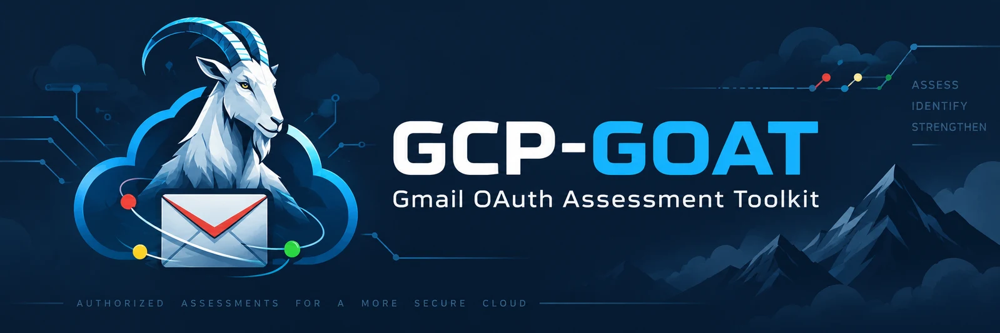
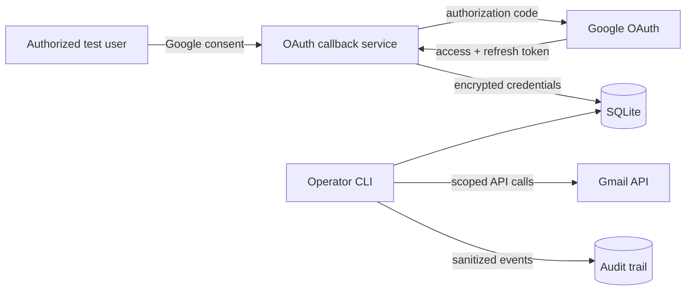

# GCP-GOAT

**Gmail OAuth Assessment Toolkit for authorized red and purple team operations.**

[](https://github.com/Logan-Elliott/gcp-goat/actions/workflows/ci.yml)
[](https://www.python.org/)
[](LICENSE)



GCP-GOAT is an authorized red and purple team assessment toolkit for exercising OAuth consent, delegated Gmail access, token persistence, mailbox activity, detection, and cleanup through a Google Cloud project.

It combines a small OAuth callback service with an operator CLI. A user completes Google's real consent flow, the service encrypts the resulting credentials in SQLite, and an authorized operator can perform scoped Gmail API actions from the assessment host. Actions execute normally; add `--dry-run` when you want a local preview first.

> Use this project only against accounts and environments covered by written authorization and rules of engagement.

## Highlights

- Real Google OAuth web-server flow with state validation and offline access
- Fernet-encrypted access tokens, refresh tokens, and OAuth client secrets at rest
- Reliable token-expiry persistence and refresh handling
- Inbox metadata listing and message retrieval without changing read state
- Controlled message sending, trashing, and Gmail filter management
- Optional local-only dry-run previews for mailbox and credential actions
- Local JSON audit trail that excludes tokens and message contents
- Grant revocation and credential cleanup workflow
- Read-only and operator scope profiles
- Docker, Gunicorn, Azure-compatible proxy support, tests, linting, and CI
- Terminal control-character filtering for mailbox-controlled output

## Architecture



The callback service never exposes a database browser or token-management endpoint. Operational actions stay on the host through `gcp-goat`.

## Quick start

### 1. Configure Google Cloud

1. Create or select a dedicated Google Cloud project.
2. Enable the Gmail API.
3. Configure the OAuth consent screen for the accounts in scope.
4. Create an OAuth 2.0 **Web application** client.
5. Register your exact callback URL, such as `https://operator.example.com/oauth/callback`.

Google Workspace app-access controls and OAuth publishing status can restrict who may authorize the application. An external app left in Testing normally receives seven-day refresh tokens when Gmail scopes are requested.

### 2. Install

```bash
git clone https://github.com/Logan-Elliott/gcp-goat.git
cd gcp-goat
python -m venv .venv
source .venv/bin/activate
python -m pip install -e .
```

Generate local secrets:

```bash
gcp-goat keygen
cp .env.example .env
```

Copy both generated values and the Google OAuth settings into your secret manager or shell environment. The project intentionally does not load `.env` automatically in production.

```bash
export GOOGLE_CLIENT_ID='...apps.googleusercontent.com'
export GOOGLE_CLIENT_SECRET='...'
export GOOGLE_REDIRECT_URI='https://operator.example.com/oauth/callback'
export GMAIL_OAUTH_ENCRYPTION_KEY='...'
export FLASK_SECRET_KEY='...'
export GMAIL_OAUTH_DB_PATH='./data/oauth_tokens.db'
```

### 3. Start the callback service

For local testing:

```bash
gcp-goat-server
```

For a deployment behind HTTPS:

```bash
export GMAIL_OAUTH_TRUST_PROXY=true
gunicorn --bind 0.0.0.0:8000 --workers 1 'gcp_goat.web:create_app()'
```

Open the service, review the authorization notice, and continue to Google's consent screen. Successful grants are stored in the configured SQLite database.

### 4. Operate and clean up

```bash
# Confirm local configuration and list stored account metadata
gcp-goat doctor
gcp-goat accounts

# Read-only operations
gcp-goat profile --email user@example.com
gcp-goat list --email user@example.com --max 5
gcp-goat list --email user@example.com --query 'from:security@example.com newer_than:7d'
gcp-goat read --email user@example.com MESSAGE_ID
gcp-goat list-filters --email user@example.com

# Send a message normally
gcp-goat send --email user@example.com \
  --to recipient@example.com --subject 'Authorized test' --body 'Test message'

# Preview the same action without changing Gmail
gcp-goat send --email user@example.com \
  --to recipient@example.com --subject 'Authorized test' --body 'Test message' --dry-run

# Export evidence and revoke access during cleanup
gcp-goat audit --limit 500 > operator-audit.json
gcp-goat revoke --email user@example.com
```

## Command reference

| Command | Purpose | Changes external state |
|---|---|---:|
| `keygen` | Generate encryption and Flask session keys | No |
| `doctor` | Validate database permissions and configuration | No |
| `accounts` | List account metadata without tokens | No |
| `profile` | Verify access and show mailbox-wide totals | No |
| `list` / `read` | List inbox metadata, search with Gmail syntax, or retrieve content | No |
| `send` | Send a plain-text email | Yes; use `--dry-run` to preview |
| `trash` | Move a message to Trash | Yes; use `--dry-run` to preview |
| `list-filters` | Inspect filters | No |
| `create-filter` / `delete-filter` | Change filter configuration | Yes; use `--dry-run` to preview |
| `audit` | Export the local operation trail | No |
| `revoke` | Revoke the Google grant and remove local credentials | Yes; use `--dry-run` to preview |
| `remove-local` | Remove only the encrypted local credential | Yes; use `--dry-run` to preview |
| `migrate-legacy` | Encrypt the original database and remove its plaintext table | Local change; use `--dry-run` to preview |

Use `gcp-goat COMMAND --help` for all arguments. JSON output is available on commands intended for downstream processing.

## Scope profiles

Set `GMAIL_OAUTH_SCOPE_PROFILE` before authorization:

| Profile | Google scopes | Intended use |
|---|---|---|
| `readonly` | `gmail.readonly` | Collection and detection validation without mailbox changes |
| `operator` | `gmail.modify`, `gmail.settings.basic` | Message and filter operations |

The project does not request `gmail.settings.sharing`. Gmail's delegate-management endpoint requires a Workspace service account with domain-wide delegation and cannot be exercised with the user OAuth grant captured here.

Changing a profile requires a new consent flow so Google can issue a grant for the new scopes.

## Existing database migration

Versions before 1.0 stored tokens in a plaintext `user_tokens` table. Point this release at the existing database, configure an encryption key, and run:

```bash
gcp-goat migrate-legacy --dry-run
gcp-goat migrate-legacy
```

The first command previews the operation. The second copies valid rows into encrypted v2 storage and drops the plaintext table. Back up engagement evidence before migration.

## Deployment

The included [Dockerfile](Dockerfile) runs the callback service as a non-root user with a persistent `/data` volume. Supply secrets at runtime; never bake them into an image.

```bash
docker build -t gcp-goat:1.0.0 .
docker run --rm --name gcp-goat \
  --publish 8000:8000 \
  --env-file .env \
  --env GMAIL_OAUTH_DB_PATH=/data/oauth_tokens.db \
  --volume gcp-goat-data:/data \
  gcp-goat:1.0.0
```

The redirect URI in `.env` must exactly match the URI configured in Google Cloud. Place HTTPS in front of the container for any deployment beyond local testing.

Azure App Service deployments should mount persistent storage, set `GMAIL_OAUTH_DB_PATH=/home/data/oauth_tokens.db`, enable `GMAIL_OAUTH_TRUST_PROXY=true`, and use the Gunicorn command shown above. Keep a single web worker when using SQLite.

## Assessment guidance

The initial consent and subsequent activity can generate user-visible and administrator-visible evidence. Message retrieval does not remove Gmail's `UNREAD` label, while sending, trashing, and filter changes alter mailbox state. Treat refresh tokens as engagement credentials and include explicit revocation in the cleanup plan.

See the [operator guide](docs/OPERATOR_GUIDE.md), [detection guide](docs/DETECTION.md), and [security policy](SECURITY.md) for engagement planning and defensive validation.

## Development

```bash
python -m pip install -e '.[dev]'
ruff check .
pytest --cov=gcp_goat
```

The test suite uses fakes and temporary encrypted databases. It does not contact Google or access a mailbox.
